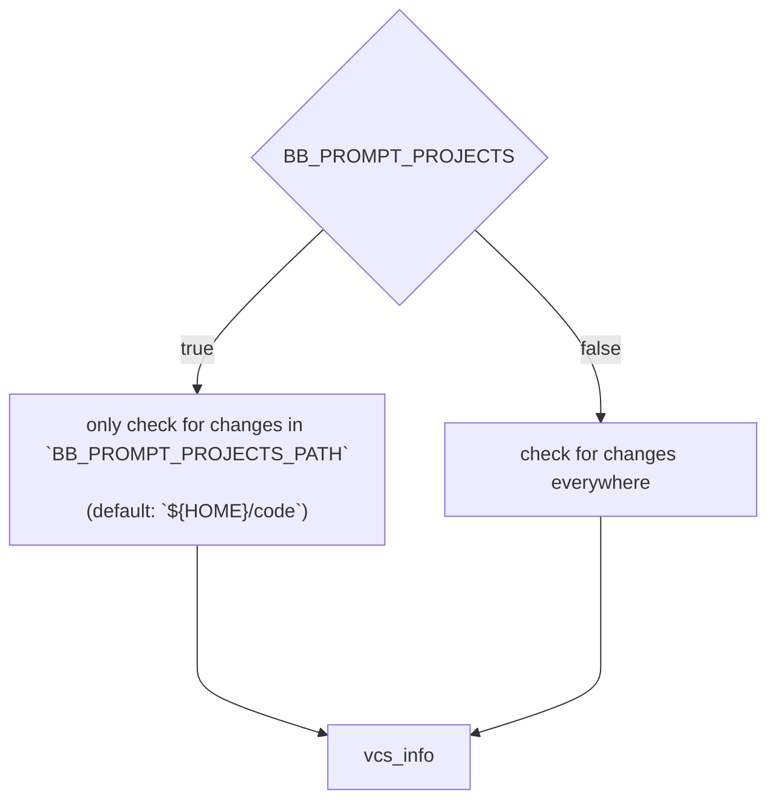

<p align="center"></p>
<p align="right"><sub>* screenshot taken in <a href="https://github.com/warpdotdev/Warp">warp</a> terminal</sub></p> 
<h1 align="center">BB 🦴 -- backbone zsh prompt -- git</h1>
<p align="center">A bare minimum single file prompt, fast as a roadrunner MEEP! MEEP! 💨 ...</p>

<br><br>

BackBone is a prompt with the bare minimum needed for a working zsh prompt that tracks git changes.  
BB[^1] is ~a blazingly fast~ the roadrunner of the prompts! Be prepared for some [Meep! Meep! Moments](https://youtu.be/Hd2JgADY9d8).

I was in need of a super simple minimal prompt that fulfills my needs. It has to be fast, easy to setup, a single file and have git support with minimal features. Furthermore i ended up building this one.

If you are like me and just looking for a prompt that is _"not more than the bare minimum needed"_  
**-- Stop looking!**

## Table of Contents
* [Information in advance](#information-in-advance)
* [Install](#install)
* [Explanation of elements](#explanation-of-elements)
* [Colorization options](#colorization-options--settings)
* [Example config](#example-config)
* [Todo](#todo)

## Information in advance
### Projects Path
This prompt is optimized to be speedy in big repositories. By default it will only enable checking for git changes in specified folder.

The default setup expects the projects you work on daily to be in the folder `$HOME/code`. If you are not happy with that setup simply set the `BB_PROMPT_PROJECTS_PATH="$HOME/whatever/you/desire` var to your desired path.

> [!NOTE]  
> It is also possible to deacitvate that behaviour completely by setting the `BB_PROMPT_PROJECTS=false` to false.



## Install
### Clone the repository:
* Clone into `~/.zsh`
  ```zsh
  git clone git@github.com:lmllrjr/backbone-zsh-prompt.git ~/.zsh/backbone-zsh-prompt
  ```
* Clone into `~/.config/zsh`
  ```zsh
  git clone git@github.com:lmllrjr/backbone-zsh-prompt.git ~/.config/zsh/backbone-zsh-prompt
  ```

### For the purists, download the only relevant file `bb.zsh`:
* Download to `~/.zsh`:
  ```zsh
  curl -Lo ~/.zsh/backbone-zsh-prompt/bb.zsh --create-dirs \
  https://raw.githubusercontent.com/lmllrjr/backbone-zsh-prompt/main/bb.zsh
  ```
* Download to `~/.config/zsh`:
  ```zsh
  curl -Lo ~/.config/zsh/backbone-zsh-prompt/bb.zsh --create-dirs \
  https://raw.githubusercontent.com/lmllrjr/backbone-zsh-prompt/main/bb.zsh
  ```
* Simply just download the file without creating any directories:
  ```zsh
  curl -LO https://raw.githubusercontent.com/lmllrjr/backbone-zsh-prompt/main/bb.zsh
  ```

### Load the prompt in your `.zshrc` file:
* Load from `~/.zsh`:
  ```zsh
  # only load prompt if the `bb.zsh` file exists
  [ -f $HOME/.zsh/backbone-zsh-prompt/bb.zsh ] && \
  source $HOME/.zsh/backbone-zsh-prompt/bb.zsh
  ```
* Load from `~/.config/zsh`:
  ```zsh
  # only load prompt if the `bb.zsh` file exists
  [ -f $HOME/.config/zsh/backbone-zsh-prompt/bb.zsh ] && \
  source $HOME/.config/zsh/backbone-zsh-prompt/bb.zsh
  ```

## Explanation of elements


## Colorization options / settings
| Option                  | Description                              | Default value    | Type    |
|-------------------------|------------------------------------------|------------------|---------|
| BB_PROMPT_DIR           | The working directory                    | `"#6c71c4"`      | string  |
| BB_PROMPT_GIT           | The shown VCS in use (`git:()`)          | `"#586e75"`      | string  |
| BB_PROMPT_BRANCH        | The git branch name                      | `"#dc322f"`      | string  |
| BB_PROMPT_ACTION        | The git actions rebase/merge             | `"#b58900"`      | string  |
| BB_PROMPT_AHEAD_BEHIND  | The ahead and behind arrows + counters   | `"#2aa198"`      | string  |
| BB_PROMPT_TAG           | The git tag                              | `"#93a1a1"`      | string  |
| BB_PROMPT_COUNT         | Changed file count on branch             | `"#93a1a1"`      | string  |
|                         |                                          |                  |         |
| BB_PROMPT_SHOW_TAG      | Turn show tag option on or off           | `false`          | bool    |
| BB_PROMPT_PROJECTS_PATH | The path of the project folder           | `"${HOME}/code"` | string  |
| BB_PROMPT_PROJECTS      | Turn the project folder option on or off | `true`           | bool    |
| BB_PROMPT_SIGN          | Set the character of the prompt          | `"%"`            | string  |

## Example config
Just set the variables in your `.zshrc` file.

> [!IMPORTANT]    
> Make sure to set the vars before actually loading the prompt!

### `~/.zshrc`:
```zsh
# set vars
export BB_PROMPT_DIR=6
export BB_PROMPT_GIT="#EEEEEE"
export BB_PROMPT_TAG="blue"
export BB_PROMPT_PROJECTS_PATH="${HOME}/my/projects/path"
export BB_PROMPT_PROJECTS=false
export BB_PROMPT_SHOW_TAG=true
export BB_PROMPT_SIGN="$"

# only load prompt if the `bb.zsh` file exists
[ -f $HOME/.config/zsh/backbone-zsh-prompt/bb.zsh ] && \
source $HOME/.config/zsh/backbone-zsh-prompt/bb.zsh
```

> [!NOTE]  
> If you want a fully-fledged prompt you should use one of the more sophisticated projects around github.  
> E.g. [Pure](https://github.com/sindresorhus/pure) ❤️.

## Todo
- [x] better screenshots (do not forget ahead and behind)
  - now has a better and more appealing picture that explains the elements of the prompt
- [x] adjust color of slash in between ahead and behind
  - now has the color of `BB_PROMPT_GIT`
- [x] option to turn off estyle-cfc / only checking for changes in `~/code/...`
  - furthermore there is another option to set the directory of the projects folder
- [x] remove more unused code!?
- [x] option for showing git tag!?
- [x] option to set prompt sign for e.g. iterm
- [x] use ansi escape codes for terminal colors when not in warp terminal
- [x] fix git-tag issue (when git-tag is set but no git tag is present the space between the branchname and staged/unstaged symbol is not being displayed)
- [ ] easier installation
- [ ] custom colorization of prompt sign success/failure
- [ ] make it faster!?
- [ ] option for DEBUG!?

~- [ ] adjust VARs (more/rmv?)~


[^1]: BackBone zsh prompt
