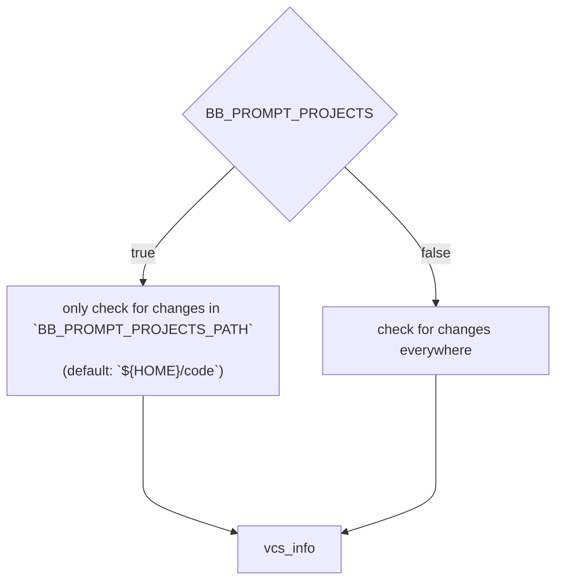

<p align="center"></p>
<p align="right"><sub>* screenshot taken in <a href="https://github.com/warpdotdev/Warp">warp</a> terminal</sub></p> 
<h1 align="center">BB 🦴 -- backbone zsh prompt -- git</h1>
<p align="center">A bare minimum single file prompt, fast as a roadrunner MEEP! MEEP! 💨 ...</p>

<br><br>

BackBone is a prompt with the bare minimum needed for a working zsh prompt that tracks git changes.  
BB[^1] is ~a blazingly fast~ the roadrunner of the prompts! Be prepared for some [Meep! Meep! Moments](https://youtu.be/Hd2JgADY9d8).

I was in need of a super simple minimal prompt that fulfills my needs. It has to be fast, easy to setup, a single file and have git support with minimal features. Furthermore i ended up building this one.

If you are like me and just looking for a prompt that is _"not more than the bare minimum needed"_  
**-- Stop looking!**

## Table of Contents
* [Information in advance](#information-in-advance)
* [Install](#install)
* [Explanation of elements](#explanation-of-elements)
* [Colorization options](#colorization-options--settings)
* [Example config](#example-config)
* [Todo](#todo)

## Information in advance
### Projects Path
This prompt is optimized to be speedy in big repositories. By default it will only enable checking for git changes in specified folder.

The default setup expects the projects you work on daily to be in the folder `$HOME/code`. If you are not happy with that setup simply set the `BB_PROMPT_PROJECTS_PATH="$HOME/whatever/you/desire` var to your desired path.

> [!NOTE]  
> It is also possible to deacitvate that behaviour completely by setting the `BB_PROMPT_PROJECTS=false` to false.



## Install
### Clone the repository:
* Clone into `~/.zsh`
  ```zsh
  git clone git@github.com:lmllrjr/backbone-zsh-prompt.git ~/.zsh/backbone-zsh-prompt
  ```
* Clone into `~/.config/zsh`
  ```zsh
  git clone git@github.com:lmllrjr/backbone-zsh-prompt.git ~/.config/zsh/backbone-zsh-prompt
  ```

### Load the prompt in your `.zshrc` file:
* Load from `~/.zsh`:
  ```zsh
  # only load prompt if the `bb.zsh` file exists
  [ -f $HOME/.zsh/backbone-zsh-prompt/bb.zsh ] && \
  source $HOME/.zsh/backbone-zsh-prompt/bb.zsh
  ```
* Load from `~/.config/zsh`:
  ```zsh
  # only load prompt if the `bb.zsh` file exists
  [ -f $HOME/.config/zsh/backbone-zsh-prompt/bb.zsh ] && \
  source $HOME/.config/zsh/backbone-zsh-prompt/bb.zsh
  ```

## Explanation of elements


## Colorization options / settings
| Option                  | Description                              | Default value    | Type    |
|-------------------------|------------------------------------------|------------------|---------|
| BB_PROMPT_DIR           | The working directory                    | `"13"`  | string  |
| BB_PROMPT_GIT           | The shown VCS in use (`git:()`)          | `"10"`  | string  |
| BB_PROMPT_BRANCH        | The git branch name                      | `"1"`   | string  |
| BB_PROMPT_ACTION        | The git actions rebase/merge             | `"3"`   | string  |
| BB_PROMPT_AHEAD_BEHIND  | The ahead and behind arrows + counters   | `"4"`   | string  |
| BB_PROMPT_COUNT         | Changed file count on branch             | `"14"`  | string  |
|                         |                                          |                  |         |
| BB_PROMPT_TAG           | The git tag color (If not empty the git tag is active) | `""`  | string  |
| BB_PROMPT_CLOCK         | The clock (If not empty the clock is active)           | `""`  | string  |
|                         |                                          |                  |         |
| BB_PROMPT_PROJECTS_PATH | The path of the project folder           | `"${HOME}/code"` | string  |
| BB_PROMPT_PROJECTS      | Turn the project folder option on or off | `true`           | bool    |
| BB_PROMPT_SIGN          | Set the character of the prompt          | `"%"`            | string  |

## Example config
Just set the variables in your `.zshrc` file.

> [!IMPORTANT]    
> Make sure to set the vars before actually loading the prompt!

### `~/.zshrc`:
```zsh
# set vars
export BB_PROMPT_DIR=6
export BB_PROMPT_GIT="#EEEEEE"
export BB_PROMPT_TAG="blue"
export BB_PROMPT_PROJECTS_PATH="${HOME}/my/projects/path"
export BB_PROMPT_PROJECTS=false
export BB_PROMPT_SIGN="$"

# only load prompt if the `bb.zsh` file exists
[ -f $HOME/.config/zsh/backbone-zsh-prompt/bb.zsh ] && \
source $HOME/.config/zsh/backbone-zsh-prompt/bb.zsh
```

> [!NOTE]  
> If you want a fully-fledged prompt you should use one of the more sophisticated projects around github.  
> E.g. [Pure](https://github.com/sindresorhus/pure) ❤️.
